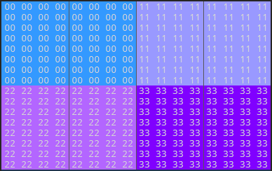
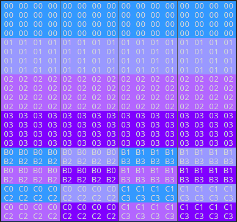

## CMV Image Block Data Format

### Note 16x16 block layout

`00` - `block 0`

`11` - `block 1`

`22` - `block 2`

`33` - `block 3`

### Note 16x16 block data layout

`00` - The `Y` value of `block 0`

`01` - The `Y` value of `block 1`

`02` - The `Y` value of `block 2`

`03` - The `Y` value of `block 3`

`B0` - The `Cb` value of `line 0~1` of block

`B1` - The `Cb` value of `line 2~3` of block

`B2` - The `Cb` value of `line 4~5` of block

`B3` - The `Cb` value of `line 6~7` of block

`C0` - The `Cr` value of `line 0~1` of block

`C1` - The `Cr` value of `line 2~3` of block

`C2` - The `Cr` value of `line 4~5` of block

`C3` - The `Cr` value of `line 6~7` of block
